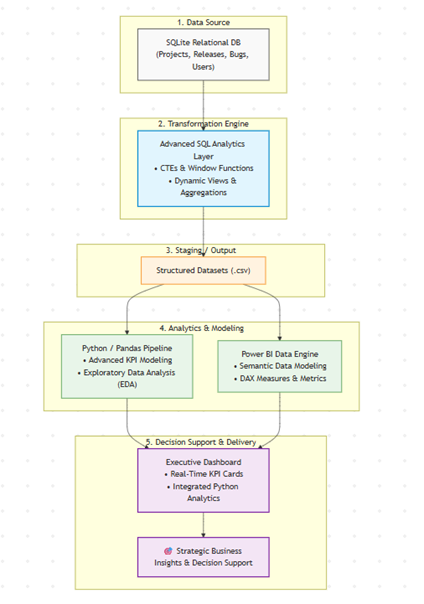
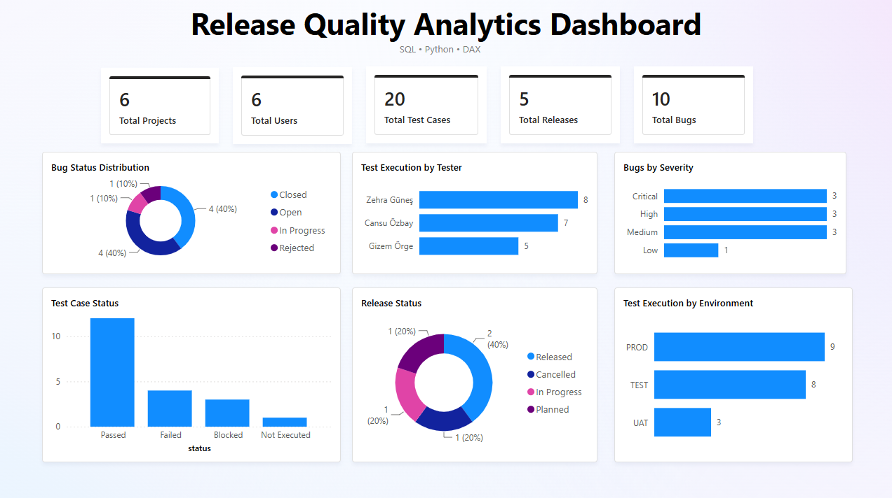
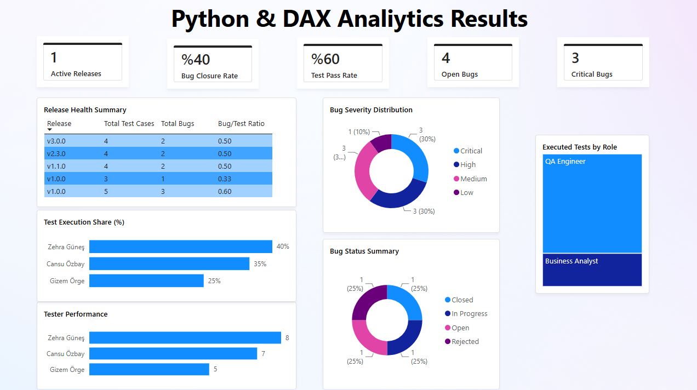
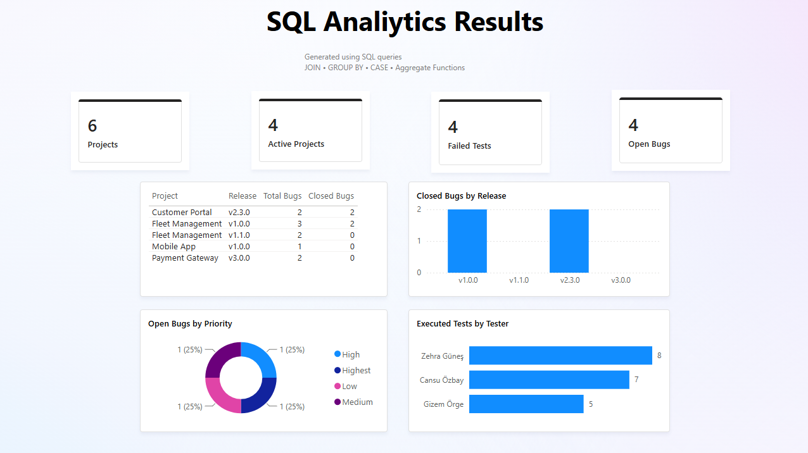
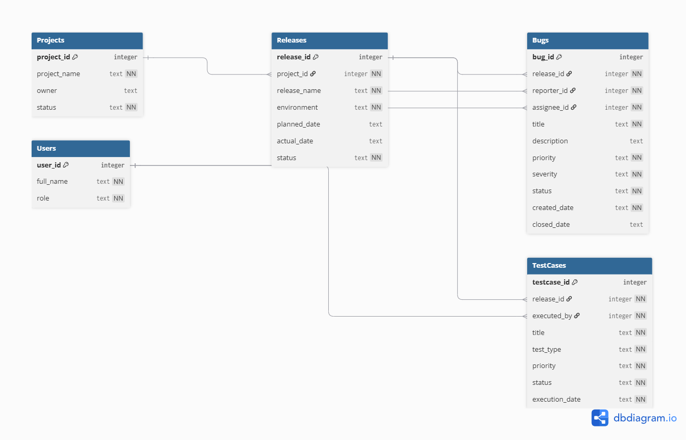

# 📊 Release Quality Analytics Platform

## Overview

This project demonstrates an end-to-end analytics workflow for software release quality using **SQLite, SQL, Python, Power BI and DAX**.

The objective was not only to build dashboards, but also to demonstrate the complete process of:

- Database design
- Data extraction
- Data analysis
- KPI creation
- Business reporting
- Dashboard development
- Documentation

Although this project uses a software quality dataset, the same workflow can easily be adapted for other domains such as:

- Supply Chain Analytics
- Project Management
- Manufacturing
- Operations
- Finance
- Sales Analytics

---

# Project Architecture



---

# Dashboard Preview

## Executive Dashboard



---

## Python Analytics Dashboard



---

## SQL Analytics Dashboard



---

# Database Schema

Entity Relationship Diagram



---

# Tech Stack

| Technology | Purpose |
|------------|----------|
| SQLite | Database |
| SQL | Data extraction & analysis |
| Python (Pandas) | Data processing & KPI generation |
| Power BI | Interactive dashboards |
| DAX | Business measures and KPIs |
| Git & GitHub | Version control |
| Markdown | Documentation |

---

# SQL Concepts Demonstrated

- JOIN
- GROUP BY
- CASE
- Aggregate Functions
- Window Functions
- Common Table Expressions (CTE)
- Views

---

# Python Analytics

Python scripts generate analytical datasets and KPIs including:

- Release Summary
- Bug Statistics
- Tester Performance
- Project Summary
- User Statistics
- Test Case Statistics
- Test Execution Summary
- Release Health Metrics
- CSV Export Pipeline

---

# Power BI Features

### Executive Dashboard

- KPI Cards
- Release Health
- Open Bugs
- Test Pass Rate
- Critical Bugs
- Active Releases

### Python Analytics

- Tester Performance
- Bug Severity Distribution
- Bug Status Distribution
- Release Health Summary
- Test Execution Share

### SQL Analytics

- Closed Bugs by Release
- Executed Tests by Tester
- Open Bugs by Priority
- Project Release Summary
- SQL-based KPI Cards

---

# Repository Structure

```
release-quality-analytics-platform/

├── Database/
│   └── release_quality.db
│
├── Documentation/
│   ├── Business_Requirements.pdf
│   ├── Future_Improvements.pdf
│   ├── Project_Architecture.pdf
│   ├── Project_Timeline_10_Days.pdf
│   └── Release_Quality_Project_SQL_Server.sql
│
├── images/
│   ├── executive_dashboard.png
│   ├── python_dashboard.png
│   ├── sql_dashboard.png
│   ├── project_architecture.png
│   └── ER-Diagramm.png
│
├── PowerBI/
│   ├── Release_Quality_Analytics_Dashboard.pbix
│   └── *.csv
│
├── Python/
│   ├── Python_Outputs/
│   ├── 01_database_connection.py
│   ├── ...
│   └── 12_release_health.py
│
├── SQL/
│   ├── Queries
│   ├── Views
│   └── SQL_Query_Outputs
│
└── README.md
```

---

# Documentation

Additional project documentation is included:

- Business Requirements
- Project Architecture
- SQL Documentation
- Future Improvements
- 10-Day Development Timeline

---

# Development Process

This project was developed as an end-to-end portfolio project to demonstrate practical data analytics and reporting capabilities.

The development included:

- Business requirement definition
- Database modeling
- SQL query development
- Python analytics
- CSV generation
- Power BI data modeling
- DAX measures
- Interactive dashboards
- Technical documentation

---

# AI-Assisted Development

Artificial Intelligence tools were used as development assistants throughout the project.

- **ChatGPT**
  - End-to-end development guidance
  - SQL, Python, Power BI and DAX implementation
  - Documentation drafting

- **Claude**
  - Architecture review
  - Project evaluation
  - Cross-checking improvements and best practices

- **Gemini**
  - General technical research
  - Reference exploration
  - Supporting documentation research

All implementation decisions, project structure and final validation were reviewed manually.

---

# Future Improvements

Potential future enhancements include:

- SQL Server integration
- Live database connection
- REST API integration
- Automated ETL pipeline
- Incremental Refresh
- Role-Level Security (RLS)
- Power BI Service deployment
- CI/CD pipeline

---

# Author

**Zehra Güler**

Industrial Engineer

Business Analysis • Product Ownership • Data Analytics • Power BI • SQL • Python